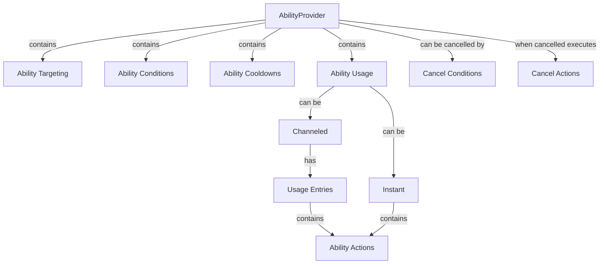

# Ability Framework Documentation

## Overview

The Ability Framework is a comprehensive system built on Entity Component System (ECS) architecture that enables the creation and management of game abilities with complex behaviors. It provides a flexible and modular approach to implementing gameplay mechanics such as attacks, spells, movement abilities, and other interactive elements.

## Core Architecture

The framework is organized around several key concepts:

## Key Components

### 1. AbilityComponents.cs

Contains the core component definitions used throughout the ability system. These components store data for:

- **Ability States**: Components like `AbilityState_Initial`, `AbilityState_Using`, etc. that track the current state of an ability
- **Ability Parameters**: Components like `Duration`, `Direction`, `InitialPosition` that store ability execution data
- **Ability Actions**: Components like `AbilityDash`, `AbilitySprint`, `AbilityChangeMana` that define specific ability behaviors
- **Ability Conditions**: Components like `DistanceToTargetGreaterThan`, `CheckSphereCondition`, `ManaCondition` that define when abilities can be used
- **Ability Targeting**: Components like `AllInAOE`, `UserTarget` that define how abilities select targets

### 2. AbilityEnum.cs

Defines enumerations used throughout the ability system:

- **Position Types**: How positions are determined (user transform, target transform, custom position)
- **Rotation Types**: How rotations are determined
- **Direction Types**: How directions are calculated
- **Target Types**: Different targeting methods (self, other, target)
- **Ability Condition Types**: Types of conditions that can be checked
- **Ability Cooldown Types**: Different cooldown mechanisms

### 3. AbilityTiming.cs

Defines how abilities are timed:
- **Instant**: Abilities that execute immediately
- **Channel**: Abilities that execute over time with a duration

### 4. AbilityUsage.cs

Manages how abilities are used:
- For instant abilities: Executes all actions immediately
- For channeled abilities: Manages a timeline of actions that execute at specific times or percentages of the channel duration
- Uses the StaticStash pattern for component access

### 5. AbilityUsageEntry.cs

Defines entries in a channeled ability's timeline:
- Can be triggered at specific times or percentages of the channel duration
- Contains a list of actions to execute when triggered

## Subsystems

### Action System

Located in `AbilityFramework/Action/`:

- **IAbilityAction**: Interface for all ability actions
- **AbilityActionWrapper**: Wrapper class that provides editor UI for selecting and configuring actions
- **AbilityActionNames/AbilityActionToTypeMap**: Maps action IDs to their implementation types
- **ActionId**: Constants for action types and groups

Actions represent what abilities do when activated, such as:
- Creating/destroying game objects
- Applying damage
- Moving/rotating transforms
- Changing stats or resources
- Applying forces to rigidbodies
- Playing particles or animations

### Condition System

Located in `AbilityFramework/Condition/`:

- **IAbilityCondition**: Interface for all ability conditions
- **AbilityConditionWrapper**: Wrapper class for selecting and configuring conditions
- **AbilityConditionFor**: Enum defining what the condition is used for (forward/use conditions or cancelling conditions)

Conditions determine when abilities can be used or when they should be cancelled, such as:
- Distance checks
- Resource checks (mana, health)
- Input checks (button pressed/released)
- Physics checks (velocity, raycast)
- State checks (GameObject active)

### Targeting System

Located in `AbilityFramework/Targeting/`:

- **IAbilityTarget**: Interface for all targeting methods
- **AbilityTargetWrapper**: Wrapper class for selecting and configuring targeting
- **AOEConfig/LimitedInAOEConfig**: Configurations for area-of-effect targeting
- **FromTargetProviderConfig**: Configuration for getting targets from a provider

Targeting determines what entities an ability affects:
- Single target (user's current target)
- Area of effect (all entities in an area)
- Limited area of effect (specific number of entities in an area)
- From target provider (targets provided by another system)

### Cooldown System

Located in `AbilityFramework/Cooldown/`:

- **IAbilityCooldown**: Interface for all cooldown types
- **AbilityCooldownWrapper**: Wrapper class for selecting and configuring cooldowns

Cooldowns control how frequently abilities can be used:
- Standard cooldown (wait time before reuse)
- Charge-based cooldown (multiple uses with recharging)

### Provider System

Located in `AbilityFramework/Provider/`:

- **AbilityProvider**: MonoBehaviour that defines an ability in the Unity editor
- **AbilityProviderFactory**: Static factory for creating ability entities
- **AbilityProviderActivator**: Handles activation of ability providers

The Provider system connects the Unity editor to the ECS architecture:
- Allows designers to create and configure abilities in the editor
- Handles creation of all necessary ECS entities and components
- Provides runtime control over abilities (activate/deactivate)

### State Machine System

Located in `AbilityFramework/StateMachine/`:

- **StateMachineProvider**: MonoBehaviour that defines a state machine
- **StateMachineProviderFactory**: Creates state machine entities
- **TransitionConfig**: Defines transitions between states
- **StateEnterActions**: Actions to execute when entering a state

The State Machine system provides behavior control:
- Defines states and transitions
- Transitions can be triggered by conditions
- States can have enter actions
- Transitions can have exit times

## Workflow

### Creating an Ability

1. Create an AbilityProvider component on a GameObject
2. Configure the ability settings:
   - Targeting method (if needed)
   - Use conditions (when the ability can be used)
   - Cooldown settings (how often it can be used)
   - Usage configuration (instant or channeled)
   - For channeled abilities, define the timeline of actions
   - Cancel conditions (when channeled abilities should be cancelled)

3. The ability can then be:
   - Activated directly through code
   - Activated by player input
   - Activated by a state machine transition
   - Activated by another ability

### Ability Execution Flow

1. When an ability is activated:
   - Conditions are checked
   - If conditions are met, the ability enters the Using state
   - For instant abilities, all actions execute immediately
   - For channeled abilities, the timeline begins

2. During a channeled ability:
   - Actions execute at their specified times
   - Cancel conditions are continuously checked
   - If a cancel condition is met, cancel actions execute

3. After ability completion:
   - Cooldown begins
   - The ability returns to its initial state

## Integration with ECS

The Ability Framework is fully integrated with the ECS architecture:

- All ability data is stored in components
- Systems process these components to implement behavior
- The StaticStash pattern is used for component access
- Providers bridge the gap between Unity's editor and the ECS world

## Best Practices

1. **Component Access**: Always use the StaticStash pattern for component access
2. **Modularity**: Build complex abilities from simple, reusable actions
3. **Conditions**: Use conditions to make abilities context-aware
4. **Targeting**: Choose the appropriate targeting method for the ability's purpose
5. **Timing**: Use channeled abilities for effects that need to happen over time
6. **State Machines**: Use state machines to create complex behavior patterns

## Conclusion

The Ability Framework provides a powerful and flexible system for implementing gameplay mechanics. By separating concerns into distinct subsystems (actions, conditions, targeting, cooldowns, and state machines), it enables the creation of complex abilities while maintaining code organization and reusability.
